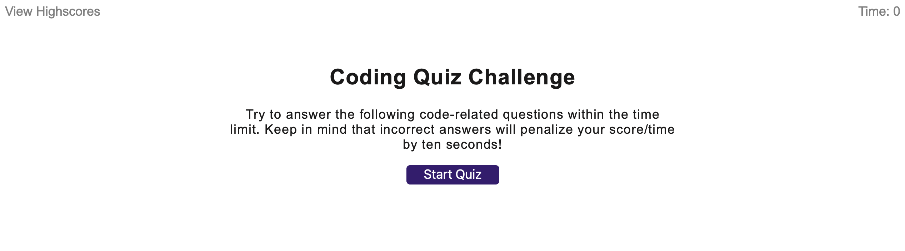
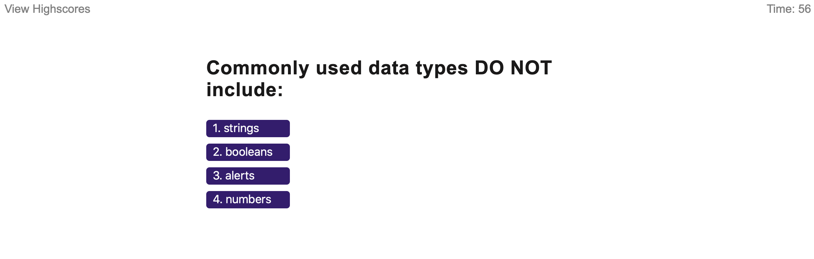
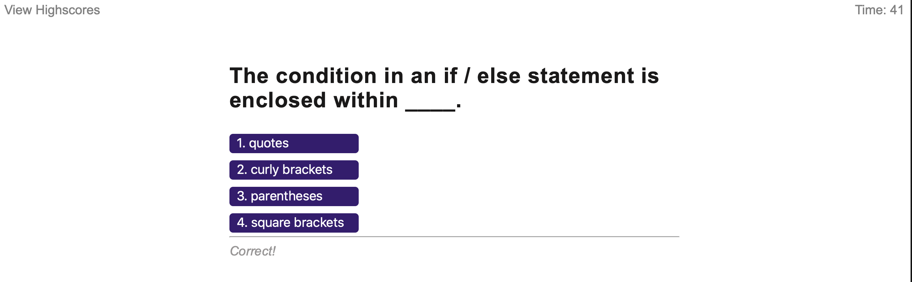
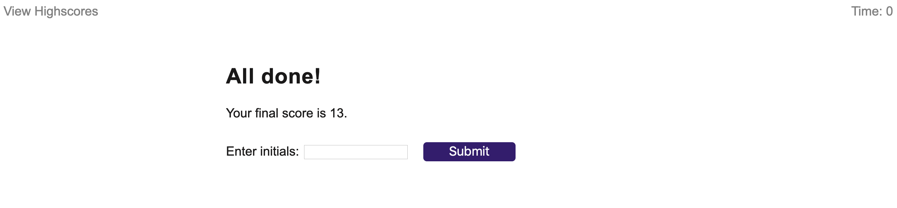
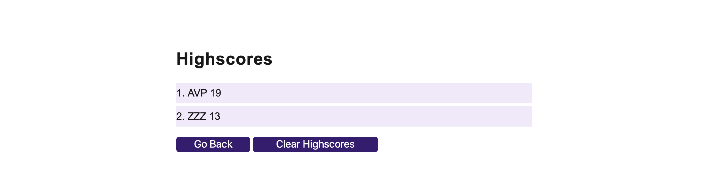

# codeQuiz
Coding Bootcamp/04-Web-APIs/Homework

## Links:

Github pages link: 'https://avpizarro.github.io/codeQuiz/'

Github repository link: 'https://github.com/avpizarro/codeQuiz.git'

## The website consists of two pages:

One where you can answer the Quiz questions:

One where you can see the high scores:

